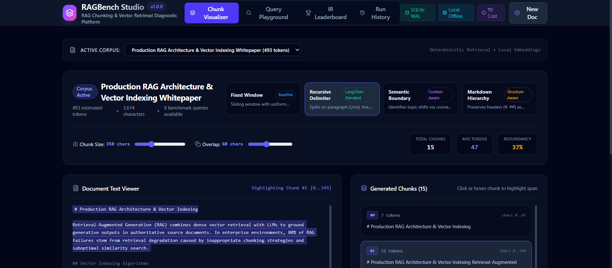
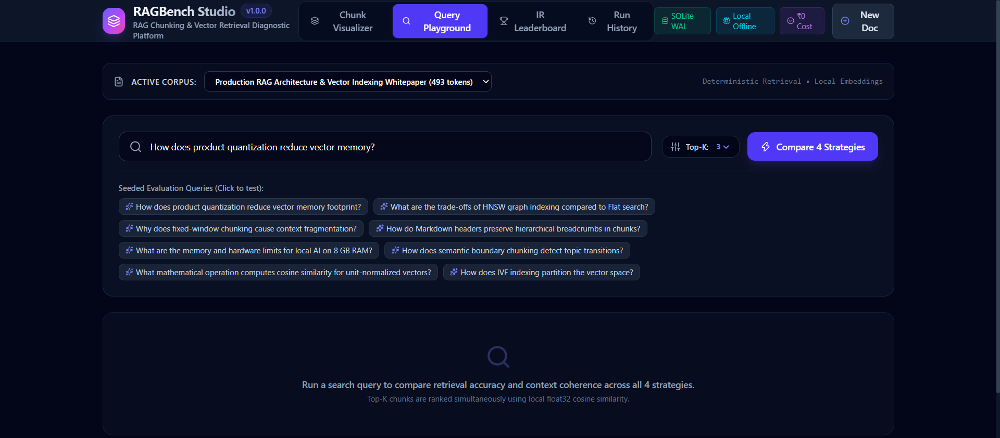
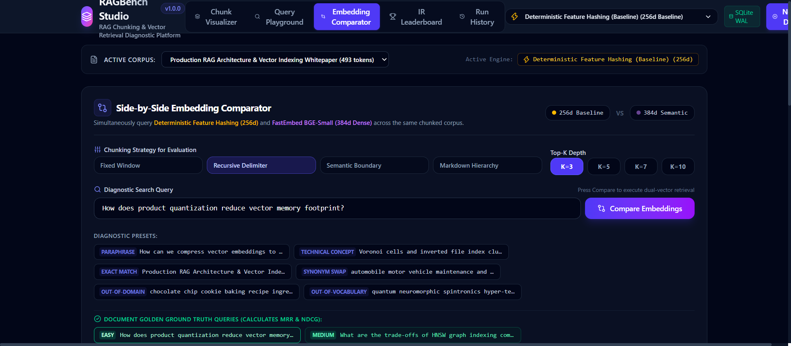
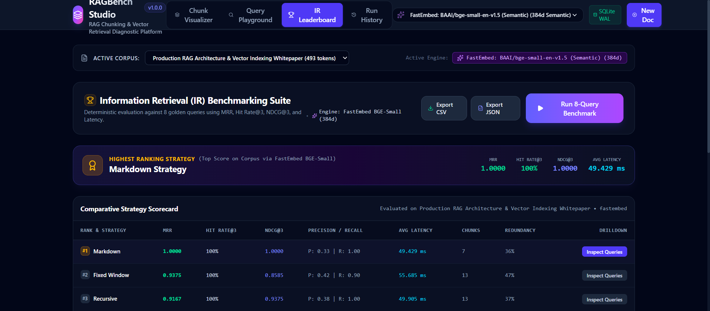
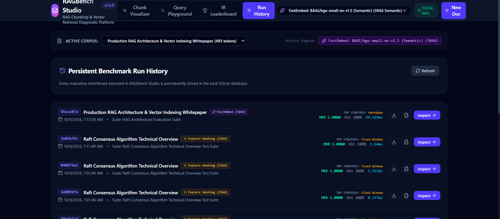

# RAGBench Studio

> **Local-First RAG Chunking Strategy & Vector Retrieval Diagnostic Platform**  
> Empirically evaluate and compare 4 document chunking strategies against golden query suites using canonical Information Retrieval (IR) metrics (MRR, Hit Rate@K, NDCG@K). 100% offline, ₹0 cloud cost, and optimized for consumer hardware (8 GB RAM / GTX 1650).

[](https://www.python.org/)
[](https://fastapi.tiangolo.com/)
[](https://react.dev/)
[](https://www.typescriptlang.org/)
[](https://tailwindcss.com/)
[](https://www.sqlite.org/)
[](https://onnxruntime.ai/)
[](LICENSE)

---

## 1. Problem Statement

In production Generative AI, **80% of RAG failures stem from retrieval degradation**, not LLM synthesis errors. When enterprise knowledge bases are chunked naively:
1. **Fixed-window slicing** blindly severs sentences and paragraphs mid-thought, destroying syntactic and semantic context.
2. **Oversized chunks** introduce irrelevant noise, diluting cosine similarity vectors.
3. **Undersized chunks** strip away critical evidence, leading to retrieval misses.

Most AI developers guess their chunking hyperparameters (`chunk_size=512, overlap=50`) without empirical measurement. **RAGBench Studio** replaces guesswork with an interactive diagnostic workbench, side-by-side vector search, dual embedding comparisons, and automated Information Retrieval (IR) benchmarking.

---

## 2. Visual Walkthrough & Screenshots

### Dashboard Overview & Chunk Visualizer
Interactive exploration of chunk boundaries, sliding character windows, and estimated token counts across 4 chunking strategies.


### Side-by-Side Query Playground
Search across all 4 chunking strategies simultaneously to inspect retrieved passage cards, cosine scores, and context boundaries in real-time.


### Side-by-Side Embedding Comparator
Compare sparse **Feature Hashing (256d)** against dense **FastEmbed BGE-small (384d)** head-to-head on the same query, measuring Jaccard Top-K overlap, latency speedup, and rank divergence.


### Canonical IR Benchmark Leaderboard
Evaluate all strategies against an 8-query golden evaluation suite using canonical Information Retrieval mathematics (MRR, Hit Rate@3, NDCG@3, Precision, Recall).


### SQLite Benchmark Run History
Permanent local run persistence in SQLite (WAL mode) with model badges, one-click run inspection, and structured CSV/JSON exports.


---

## 3. Key Features

- **4 Document Chunking Strategies**: Fixed Window (baseline), Recursive Delimiter (LangChain-style hierarchical), Semantic Boundary (sentence cosine drop transitions), and Markdown Hierarchy (header breadcrumbs & code fence protection).
- **Dual Vector Representations**:
  - *Deterministic Feature Hashing (256d)*: Sub-millisecond CPU character n-gram projection via Murmur/MD5 hashing. Zero downloads required; 100% offline out-of-the-box.
  - *FastEmbed Dense Semantic (384d)*: Small ONNX transformer embeddings (`BAAI/bge-small-en-v1.5`) running locally on CPU.
- **Side-by-Side Comparator**: Head-to-head dual-model retrieval computing Jaccard Top-K overlap, latency differentials, and cross-model rank alignment matrices.
- **Canonical IR Metrics Suite**: Mean Reciprocal Rank (MRR), Hit Rate@K, Normalized Discounted Cumulative Gain (NDCG@K), Precision@K, Recall@K, and Token Redundancy Ratio.
- **Zero-Cloud SQLite Persistence**: Full relational storage in SQLite WAL mode for documents, chunk collections, test query sets, and historical benchmark runs.
- **Data Import & Export**: Drag-and-drop `.txt` and `.md` document ingestion with format validation; downloadable CSV and JSON benchmark exports.

---

## 4. Architecture & Data Flow

```text
[ Document Ingestion /api/v1/documents + File Upload (.md, .txt) ]
                 │
                 ├──> [1. Fixed Window Chunker] ────────> Sliding char stride
                 ├──> [2. Recursive Delimiter Chunker] ──> Paragraph -> Sentence -> Word
                 ├──> [3. Semantic Boundary Chunker] ────> Sentence cosine drop transitions
                 └──> [4. Markdown Hierarchy Chunker] ───> Header breadcrumbs & code fence protection
                                 │
                 ┌───────────────┴───────────────┐
                 ▼                               ▼
  [ Deterministic Feature Hashing ]    [ FastEmbed BGE-Small-en-v1.5 ]
    (256d MurmurHash3, ~0.3ms CPU)       (384d Dense Semantic, ONNX CPU)
                 │                               │
                 └───────────────┬───────────────┘
                                 │
                                 ▼
                     [ SQLite Storage (WAL Mode) ]
                      ├── documents & file uploads
                      ├── chunk_collections & chunks (BLOB vectors)
                      ├── test_query_sets & test_queries
                      └── benchmark_runs & strategy_results
                                 │
        ┌────────────────────────┼────────────────────────┐
        ▼                        ▼                        ▼
[ Side-by-Side Query Search ] [ Embedding Comparator ]  [ Automated IR Benchmark Suite ]
- 4 chunkers real-time        - 256d vs 384d simultaneous- MRR & Hit Rate @ K
- Per-strategy scores         - Jaccard overlap & rank Δ- NDCG @ K & Precision/Recall
- Context boundary inspec     - Diagnostic presets suite- CSV & JSON Export
```

---

## 5. The 4 Chunking Strategies

| Strategy | Algorithm & Mechanics | Key Strength | Typical Failure Mode |
| :--- | :--- | :--- | :--- |
| **Fixed Window** | Uniform character window (default: 350) sliding with fixed stride/overlap (default: 60). | Predictable, computationally trivial baseline. | Blindly cuts across words, sentences, and code blocks. |
| **Recursive Delimiter** | Hierarchically splits text on `\n\n` $\to$ `\n` $\to$ `. ` $\to$ ` ` $\to$ `""`, merging up to target size. | Preserves paragraph and sentence cohesion. | Can still fragment semantic sections without header provenance. |
| **Semantic Boundary** | Computes sentence-level vectors; splits text when cosine similarity drops below threshold ($\tau=0.35$). | Clusters semantically coherent sentences into topic blocks. | Variable chunk lengths depending on topical density. |
| **Markdown Hierarchy** | Parses `#`, `##`, `###` headings and code blocks. Attaches breadcrumbs (`# Sec > ## Sub`) to chunks. | Retains document hierarchy and protects code blocks. | Requires structured Markdown syntax in source text. |

---

## 6. Canonical Information Retrieval (IR) Metrics

RAGBench Studio evaluates retrieval accuracy against ground-truth golden query sets using standard Information Retrieval mathematics:

### Mean Reciprocal Rank (MRR)
Measures the rank position of the first relevant chunk returned:
$$\text{RR} = \frac{1}{\text{rank}_i}, \quad \text{MRR} = \frac{1}{|Q|} \sum_{i=1}^{|Q|} \text{RR}_i$$

### Hit Rate @ K
The proportion of queries where at least one target ground-truth chunk appears in the top-$K$ retrieved items:
$$\text{HitRate}@K = \frac{1}{|Q|} \sum_{i=1}^{|Q|} \mathbb{I}(\text{rank}_i \le K)$$

### Normalized Discounted Cumulative Gain (NDCG @ K)
Penalizes relevant chunks appearing lower in the ranking order:
$$\text{DCG}@K = \sum_{i=1}^K \frac{\text{rel}_i}{\log_2(i + 1)}, \quad \text{NDCG}@K = \frac{\text{DCG}@K}{\text{IDCG}@K}$$

### Token Redundancy Ratio
Measures duplicated token overhead introduced by chunk overlaps:
$$\text{Redundancy} = 1 - \frac{|\text{Unique Tokens}|}{\sum |\text{Chunk Tokens}|}$$

### Ground Truth Methodology & Limitations
- **Dynamic Chunk Evaluation**: Because each chunking strategy generates distinct chunk counts and character boundaries (e.g., 7 chunks in Markdown vs. 21 in Semantic), static chunk IDs cannot serve as universal ground truth across all strategies.
- **Topical Keyword Evidence Matching**: Relevance is evaluated by checking if a retrieved chunk satisfies the required keyword density ($\ge 50\%$) for a golden test query.
- **Strict Evidence Requirement**: If a test query has no grounded evidence chunk in a given chunking configuration, it strictly scores `0.0` across all metrics. No heuristic fallbacks or fabricated relevance labels are applied.
- **Evaluation Scope**: Benchmark metrics reflect retrieval accuracy against the defined 8-query golden suite. They demonstrate comparative retrieval dynamics under controlled conditions, not universal benchmark superiority across all NLP domains.

---

## 7. Supported Embedding Backends

| Dimension / Mode | Implementation | Initialization / Footprint | When to Use |
| :--- | :--- | :--- | :--- |
| **Deterministic Feature Hashing (256d)** | Token n-gram hashing via Murmur/MD5 projection into float32 array. | Instantaneous (0 ms), 0 MB disk, 0.26 ms search latency. | Rapid exploratory chunk debugging, zero-dependency testing, constrained CPU environments. |
| **FastEmbed BGE-Small (384d)** | `BAAI/bge-small-en-v1.5` transformer model via ONNX Runtime CPU. | One-time 64 MB download on first query; ~5.7 ms warm search latency. | Semantic synonym retrieval, conceptual paraphrase matching, production-grade dense vector evaluation. |

> [!IMPORTANT]
> **Vector Space Isolation Guarantee**: Feature Hashing vectors (256d) and FastEmbed vectors (384d) occupy fundamentally incompatible geometric coordinate spaces. RAGBench Studio strictly isolates collections by embedding backend in SQLite, preventing invalid cross-model similarity comparisons.

---

## 8. Measured Benchmark Results (Reproducible)

Benchmarked on **Windows 11 (64-bit)**, **AMD Ryzen 5 5600H**, **8 GB System RAM**, **NVIDIA GTX 1650 4 GB GPU**:

```powershell
backend\.venv\Scripts\python.exe backend/benchmark_audit.py
```

```text
============================================================
RAGBench Studio Performance & Memory Audit
============================================================
Total Benchmark Execution Time: 128.29 ms (0.128 s)
Peak Traced Process Memory:    0.21 MB
Document Length:                3614 chars (493 words)
Evaluated Test Queries:         8
------------------------------------------------------------
Strategy               | MRR      | Hit@3    | NDCG@3   | Latency  | Chunks
------------------------------------------------------------
markdown               | 0.9375   | 100.0  % | 0.9539   | 0.43  ms | 7     
fixed_window           | 0.8125   | 87.5   % | 0.7435   | 0.81  ms | 13    
recursive              | 0.8125   | 87.5   % | 0.8289   | 0.43  ms | 13    
semantic               | 0.6667   | 87.5   % | 0.7202   | 0.48  ms | 21    
============================================================
```

> [!NOTE]
> **Key Finding**: Markdown Hierarchy chunking achieved the highest MRR (**0.9375**) and **100% Hit Rate** on the technical document because header breadcrumbs preserve context, allowing the retriever to locate exact answers with fewer total chunks (7 vs 21).

---

## 9. Getting Started (Setup & Installation)

### Prerequisites
- Windows 10/11, macOS, or Linux.
- Python 3.12 (via `uv` or Python installer).
- Node.js 18+ (Node 20 or 22+ recommended).

### Clone the Repository
```powershell
git clone https://github.com/Revanth2716/RAGBench-Studio.git
cd RAGBench-Studio
```

> [!NOTE]
> **Network Usage Note**: Initial setup requires an internet connection to install Python and npm packages. Once installed, the entire system operates **100% offline** with zero outbound cloud or API calls. Feature Hashing runs immediately offline; FastEmbed downloads its lightweight ONNX weights (64 MB) only on first semantic query or explicit warmup.

### Step 1: Backend Setup
```powershell
cd backend

# Create Python 3.12 virtual environment (using uv or standard python)
uv venv --python 3.12 .venv

# Install dependencies
uv pip install --python .venv\Scripts\python.exe -r requirements.txt

# Run automated test suite (43 tests)
.\.venv\Scripts\python.exe -m pytest -v
```

### Step 2: Frontend Setup
```powershell
cd ../frontend
npm install
npm run build
```

---

## 10. Running RAGBench Studio Locally

Open **two terminal windows**:

### Terminal 1 — Start the FastAPI Backend:
```powershell
cd backend
.\.venv\Scripts\python.exe -m uvicorn app.main:app --host 127.0.0.1 --port 8000 --reload
```
*Backend API will run at `http://127.0.0.1:8000` (interactive OpenAPI docs at `http://127.0.0.1:8000/docs`).*

### Terminal 2 — Start the React Dashboard:
```powershell
cd frontend
npm run dev
```
*Frontend interface will run at `http://localhost:5173` (proxies `/api` requests to backend).*

---

## 11. Testing & Quality Assurance

The project includes **43 automated tests** across SQLite repository persistence, the 4 chunkers, IR evaluation formulas, vector retrieval, model warmup, semantic comparison, file upload validation, benchmark export, comparator API, edge-case duplicate discounting, and FastAPI routes:

```powershell
cd backend
.\.venv\Scripts\python.exe -m pytest -v
```

```text
tests/test_api.py (9 tests) ............................ PASSED
tests/test_benchmark_export.py (2 tests) ............... PASSED
tests/test_chunkers.py (5 tests) ....................... PASSED
tests/test_embedding_comparator.py (4 tests) ........... PASSED
tests/test_embeddings_retriever.py (3 tests) ........... PASSED
tests/test_file_upload.py (5 tests) .................... PASSED
tests/test_ir_metrics.py (8 tests) ..................... PASSED
tests/test_models_and_fastembed.py (4 tests) ........... PASSED
tests/test_repository.py (3 tests) ..................... PASSED

======================== 43 passed in 2.58s ========================
```

Frontend production build check:
```powershell
cd frontend
npm run build
# Output: built in 602ms (0 errors, 0 warnings)
```

---

## 12. Hardware & Zero-Cost Architecture

- **100% On-Device Processing**: Document chunking, vector embedding, and similarity search run entirely on CPU via NumPy vectorization and FastEmbed ONNX runtime.
- **₹0 Cloud Cost**: No OpenAI/Anthropic API keys, subscriptions, or external network requests.
- **Strict Memory & Disk Footprint (Verified & Measured)**:
  - FastEmbed Model Cache (`BAAI/bge-small-en-v1.5`): **64.07 MB** on disk (`%LOCALAPPDATA%\Temp\fastembed_cache`).
  - SQLite Relational & Vector Storage: **~600 KB** in Write-Ahead Logging (WAL) mode (`backend/data/ragbench.db`).
  - Feature Hashing Warm Latency: **~0.26 ms** per query.
  - FastEmbed ONNX Warm Latency: **~5.7 ms** per query.
  - Peak Traced Process Memory: **< 1.0 MB RAM** during benchmark execution; completely safe for 8 GB RAM machines.

---

## 13. Repository Structure

```text
RAGBench-Studio/
├── backend/
│   ├── app/
│   │   ├── api/                 # FastAPI REST endpoints (health, documents, chunks, search, benchmarks, models)
│   │   ├── config.py            # Central configuration & settings
│   │   ├── data/                # Seeded technical whitepaper & 8 golden queries
│   │   ├── db/                  # SQLite schema, WAL connection factory, and repository
│   │   ├── engine/              # Chunkers (4 strategies), embedders, retriever, and IR metrics
│   │   ├── main.py              # Application entrypoint & lifespan lifecycle
│   │   └── schemas.py           # Pydantic v2 data models
│   ├── tests/                   # 43 automated unit & integration tests
│   ├── requirements.txt         # Pinned backend dependencies
│   └── .env.example             # Optional environment variable template
├── frontend/
│   ├── src/
│   │   ├── components/          # ChunkVisualizer, QueryPlayground, EmbeddingComparator, etc.
│   │   ├── api.ts               # Type-safe API client
│   │   ├── App.tsx              # Application shell & navigation tabs
│   │   └── types.ts             # TypeScript interfaces
│   ├── package.json             # Frontend dependencies (React 19, Vite, Tailwind v4)
│   └── vite.config.ts           # Development proxy & server config
├── docs/
│   └── screenshots/             # High-resolution dashboard and feature screenshots
├── LICENSE                      # MIT License
└── README.md
```

---

## 14. Troubleshooting & FAQ

#### Q: PowerShell blocks script execution when activating `.venv`?
Run:
```powershell
Set-ExecutionPolicy -Scope Process -ExecutionPolicy Bypass
```
This enables virtual environment scripts for your current terminal session only.

#### Q: Port 8000 or 5173 is already in use?
- To run FastAPI on an alternate port:
  ```powershell
  uvicorn app.main:app --port 8001
  ```
- Update `frontend/vite.config.ts` target proxy from `http://127.0.0.1:8000` to `http://127.0.0.1:8001`.

#### Q: What file formats are supported for document upload?
Plaintext (`.txt`) and Markdown (`.md`) files up to 2 MB are supported via the **New Doc** modal.

#### Q: How is ground truth determined for custom documents?
When uploading or creating a document, you can define custom golden test queries with expected keyphrases. Chunks containing $\ge 50\%$ of the query keywords are labeled as ground truth. If a query has no matching chunk in the document, it strictly evaluates to `0.0`.

---

## License

[MIT](LICENSE) — © 2026 Revanth Yarramsetti
